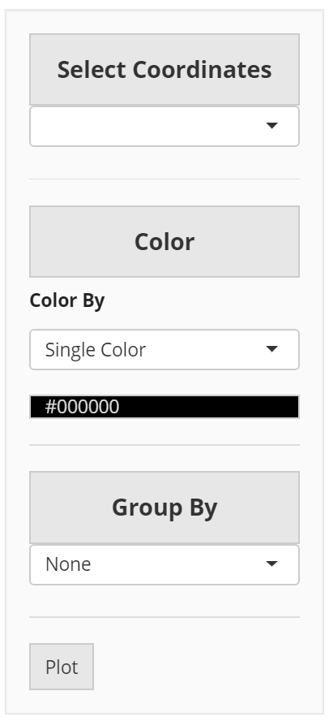

```{r setup, include=FALSE}
knitr::opts_chunk$set(echo = TRUE)
```

## R Markdown

The cellviewer is a page designed to give users the freedom to visualize their datasets in multiple different types of plots, using all the reduced dimensionality, cell annotation, and assay data that is saved in their analysis object. The viewer is divided into three tabs: scatter plots, bar plots, and violin/box plots. Each of these tabs is demonstrated in a section below. 

## Scatter Plots

On the first tab, users are free to use reduced dimensionality representations of data to create a scatter plot which represents each cell as a point. From under the reducedDims field, select the desired reduced dimension. The next field is the colorBy option. The default coloring option is to paint all the cells with a single color, and users are free to select which color to use. Other coloring options are dynamically loaded from the cell annotations and expression assays saved in the singleCellExperiment object. Cell annotations are automatically imported from column data, while expression assays allow users to display the expression of a chosen feature. 

{height = 10px}

## Bar Plots


## Violin/Box Plots


