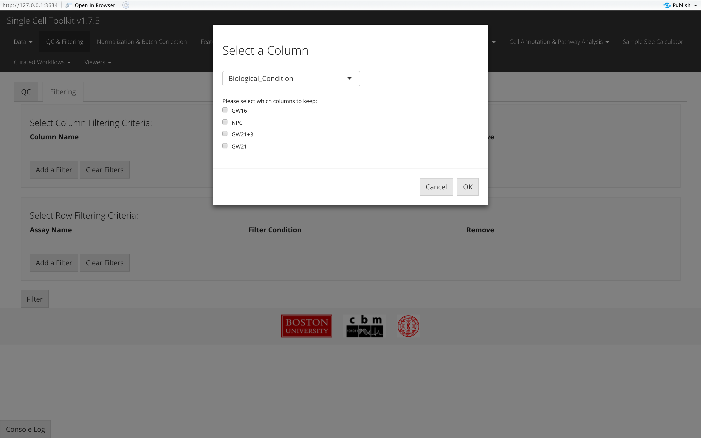
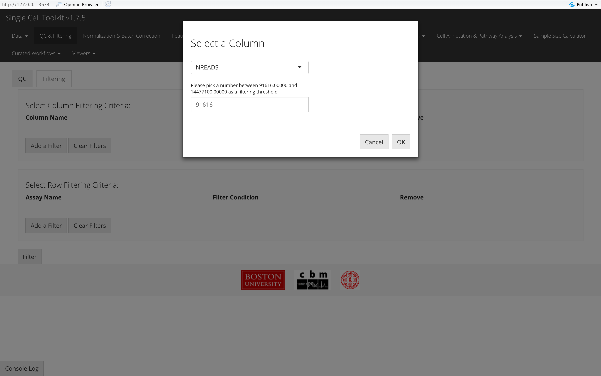
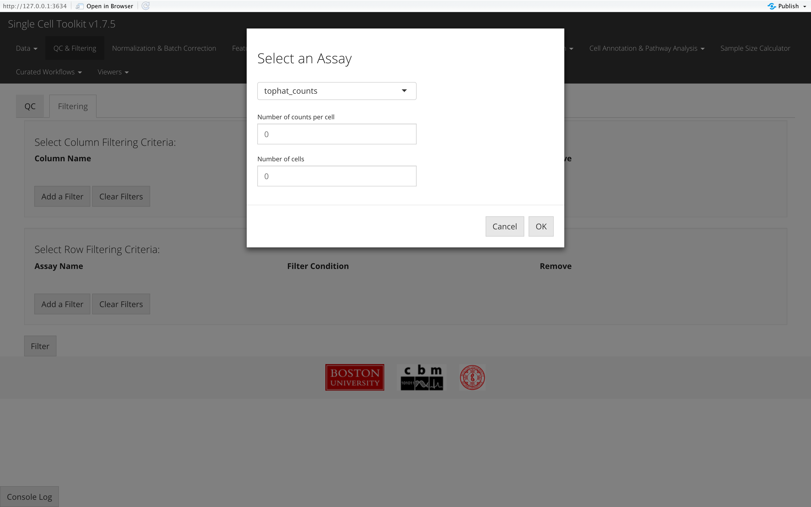

\

This section of the toolkit allows users to filter their single-cell dataset after running QC metrics or apply subsetting basing on other types of criteria. Users should enter this section as instructed by the screenshot above.  

\

Here we will take the example PBMC3K dataset as an example. We imported this dataset through the **"Data" -> "Import Single Cell Data" tab**, by selecting **"Import example datasets"** first and using the default **"PBMC 3K (10X)"** option then. We next applied three QC methods: General QC metrics, DecontX, and scDblFinder, with all default parameters. Below we will have the plots as generated by SCTK.  

## Filtering by Columns (Removing Cells)

To filter by columns, the user must click the "**Add a Filter**" button in the "**Select Column Filtering Criteria**" panel. A pop-up will appear which asks the user to select which column to filter, and based on that selection, more input fields will appear for the user to specify how they would like to filter. If the column contains categorial information, the user will have to select which values to keep. If the column contains numerical values, the user must provide a threshold value so that the filter will keep all values above that threshold.

{width=450px} {width=450px}

## Filtering by Rows

To filter by rows, the user must click the "Add a Filter" button in the Select Row Filtering Criteria" panel, and a pop-up will appear which asks the user to select which specify which rows to filter out. Rows are filtered by specifying how many counts genes should appear in how many cells by assay, so the user must first select an assay from the dropdown menu. Then, in the two numeric input fields that will appear, the user must specify how many counts and in how many cells they want to see the gene.

## Applying Filters
For both row and column filtering, once a criterion has been specified in the pop-up, the user must click "OK" to see it in the corresponding table on the main page. Once the user has defined all their filtering criteria, the user must click "Filter" to apply the filters to the SCE object.

