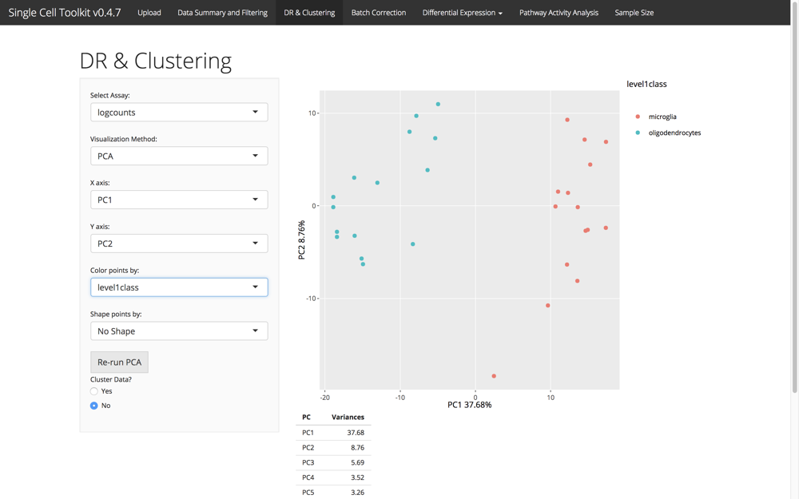
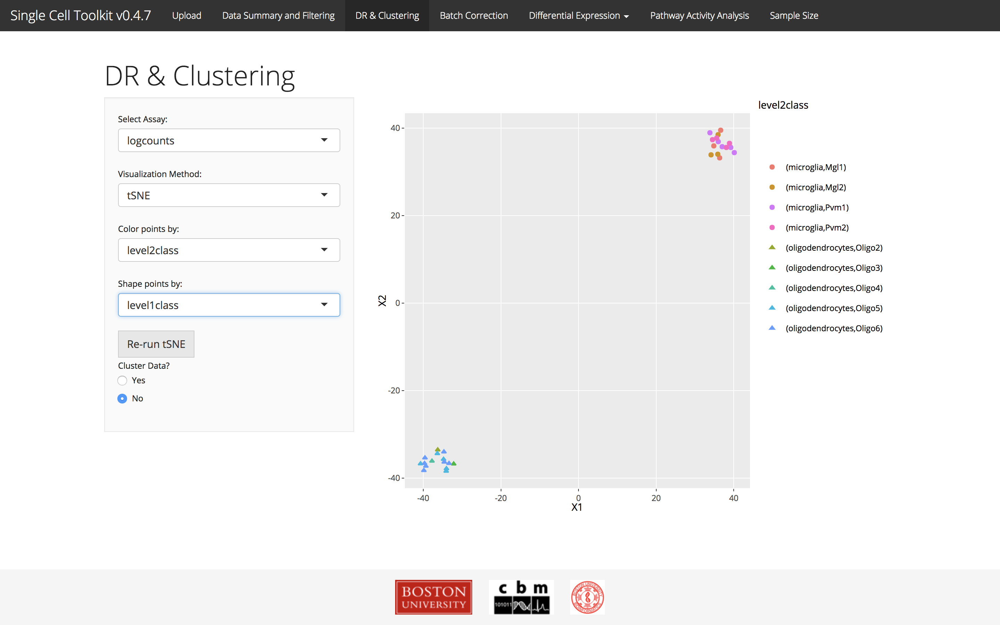
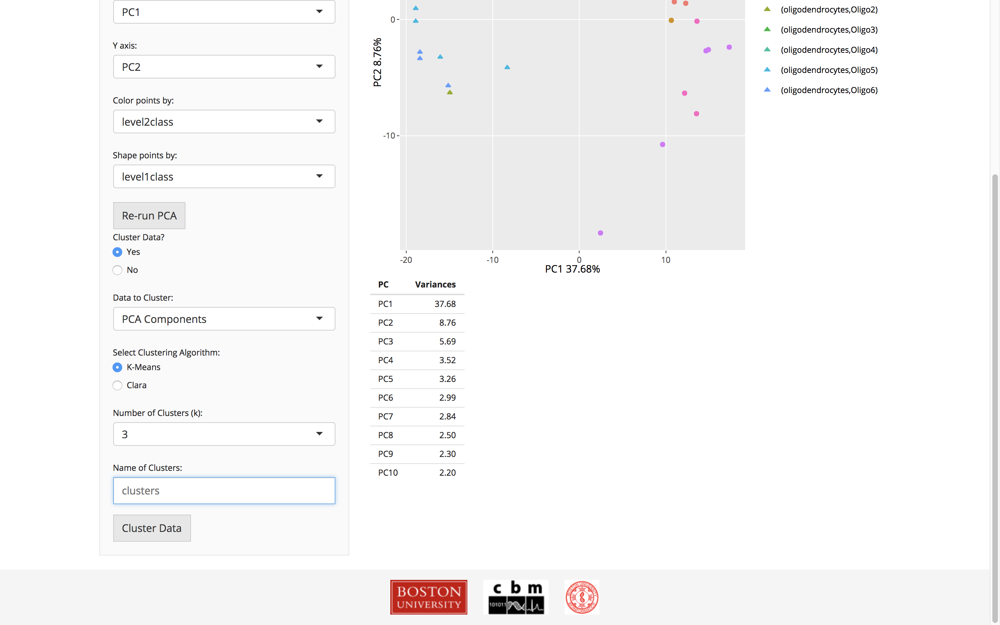

# Introduction

Use the dimensionality reduction and clustering tab to visualize scRNA-Seq data,
identify potential batch effects, and cluster data for downstream analysis. The
data used for analysis in this tab is stored in the reducedDim slot of the
SingleCellExperiment object. If PCA or t-SNE data is not pre-computed, it will
run automatically and the results will be stored inside the object. For large
datasets, PCA and t-SNE can take a long time, so pre-computing this data is
recommended. If you wish to re-run PCA or t-SNE, you can click the "Re-run"
button and the data will be replaced.

# Visualization



Currently, the SCTK supports visualization of PCA scatterplots, t-SNE
scatterplots, and a dendrogram of clustering from hierarchical clustering. For
PCA and t-SNE, the points in the scatterplot can be colored and shaped by the
columns of annotation data available in the underlying object. In addition,
points can be colored by individual gene expression values

# Clustering



It is also possible to cluster the data using
[K-Means](https://en.wikibooks.org/wiki/Data_Mining_Algorithms_In_R/Clustering/K-Means)
or [Clara](https://en.wikibooks.org/wiki/Data_Mining_Algorithms_In_R/Clustering/CLARA).
Choose the data to use for clustering, the clustering algorithm, the number of
clusters, and a name for the clustered data. The clustering results will be
stored in the annotation data frame and be available on the other tabs.

# Session info {.unnumbered}

```{r sessionInfo, echo=FALSE}
sessionInfo()
```
