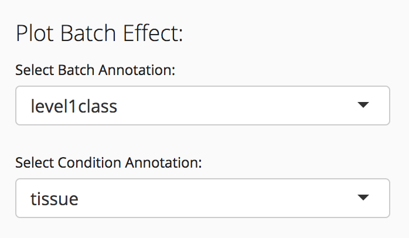
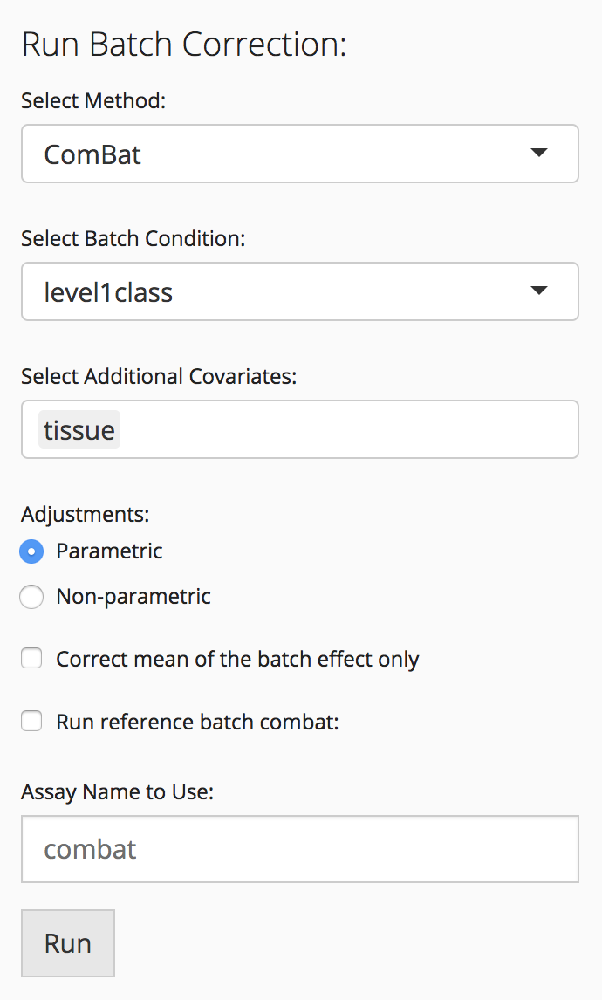

# Introduction

Because of the complexities of the library preparation and the low starting
material in scRNA-Seq experiments, non-biological variation (batch effects) are
present and can be a major source of variation present in single cell
experiments [@Hicks2017-oj]. ComBat is a widely used method for adjusting for
batch effects in microarray and RNA-Seq data [@Johnson2007-py]. If users
identify variation associated with a technical effect, ComBat can be run within
the SCTK to remove this variation before further downstream analysis. Users can
choose an annotation present in the annotation data frame and add additional
covariates to the ComBat model before performing batch correction. After batch
correction, the ComBat results are stored as an additional assay in the
SCtkExperiment object, which can then be used in the other analysis tabs within
the SCTK.

# Plot Batch Effect



Analysis on the batch correction tab is performed on the assay selected in the
"Select Assay" field. To visualize the batch effect present in the data, select
an annotation column from the annotation data frame in the "Select Batch
Annotation" drop down and an experimental condition annotation in the "Select
Condition Annotation" drop down. A set of boxplots will appear that show the
percent variation explained by condition+batch, condition alone, and batch
alone.

# Run Batch Correction

Select a batch correction method from the "Select Method" drop-down. Currently,
only ComBat is supported, but additional methods will be added in later versions
of the toolkit. After batch correction, the corrected data will be saved as an
additional assay in the SCtkExperiment object. Choose a name for this assay in
the "Assay Name to Use" field.

## ComBat



To run ComBat batch correction, select a batch annotation, add any additional
covariates to the model, and adjust any of the ComBat parameters available. For
details about the available options for ComBat analysis, see the
[ComBat documentation](https://www.bioconductor.org/packages/release/bioc/html/sva.html).

# Session info {.unnumbered}

```{r sessionInfo, echo=FALSE}
sessionInfo()
```

# References {.unnumbered}
