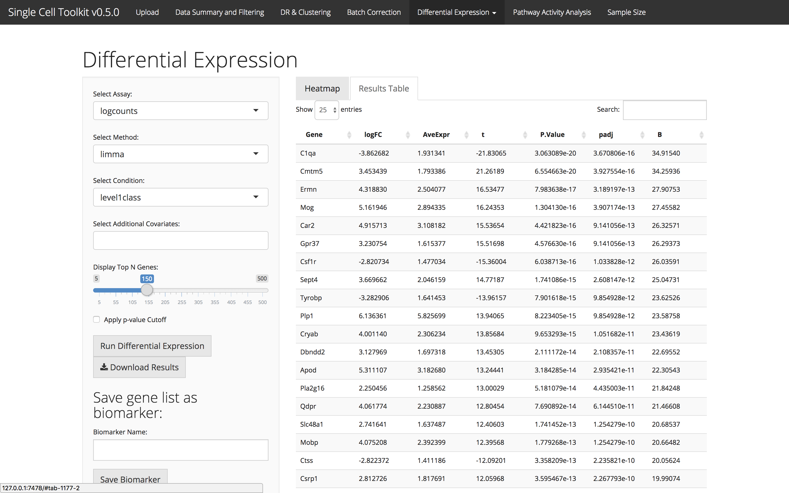
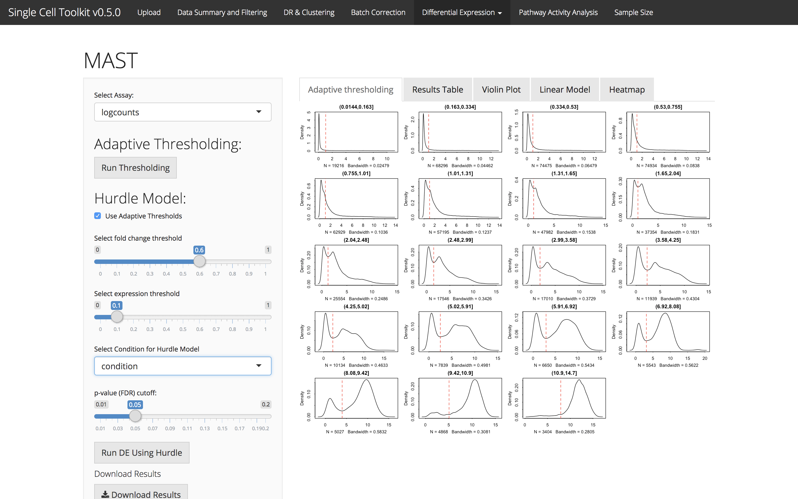
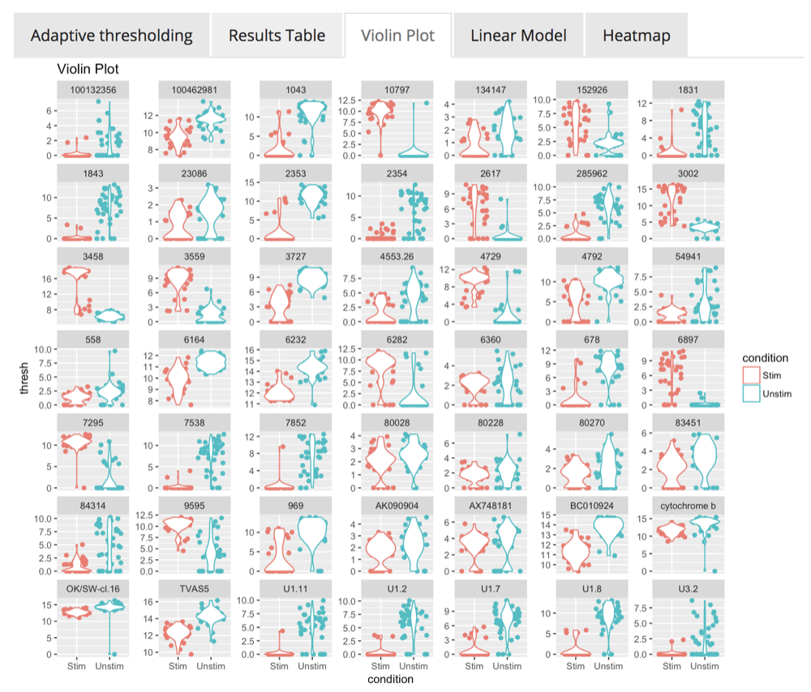
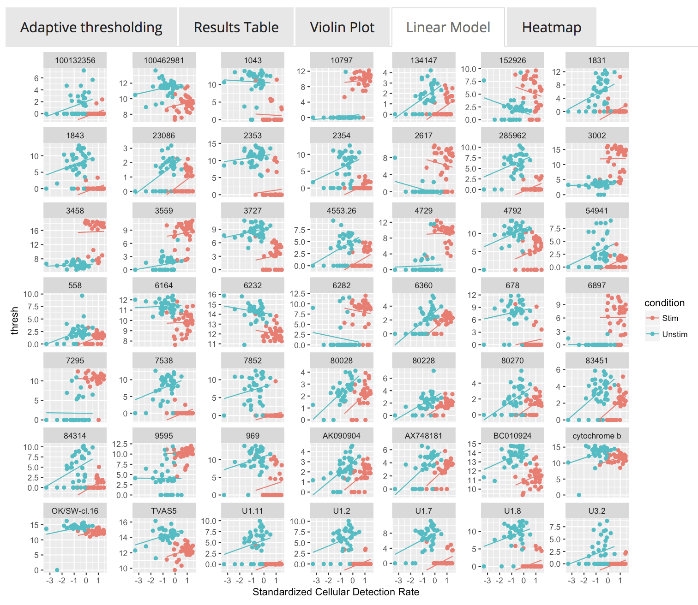
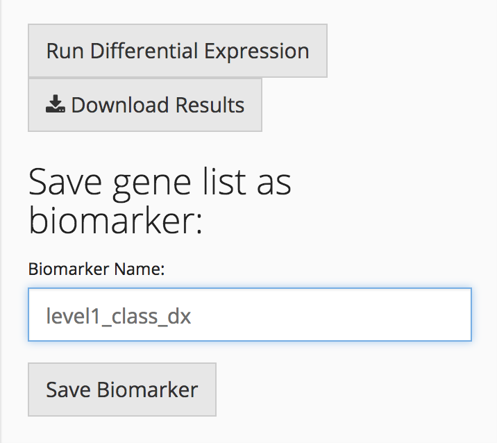

# Introduction

Differential expression analysis can identify genes that are significantly up or
down regulated between conditions. While many differential expression algorithms
exist, their performance may vary on scRNA-Seq datasets.

# limma, DESeq2, and ANOVA

Users can apply common differential expression algorithms
[limma](https://bioconductor.org/packages/release/bioc/html/limma.html),
[DESeq2](https://bioconductor.org/packages/release/bioc/html/DESeq2.html), or
perform an ANOVA to identify differentially expressed genes by selecting one or
multiple condition variables present in the annotation information. After
choosing the assay of interest using the "Select Assay" field and the algorithm
in the "Select Method" field, choose the experimental condition and any
additional covariates to use in the differential expression model. For limma
analysis with a condition with more than two categories, a "Factor of Interest"
must be selected. For DESeq2 analysis with more than two categories, users can
select one of three modes. In Biomarker mode, select a factor of interest. The
resulting genes will be differentially expressed between the factor of interest
and all other cells. For factor of interest vs control factor analysis, the user
selects a factor of interest and a control factor and the resulting genes will
be significantly differentially expressed between these two-factor levels.
Finally, for ANOVA, DESeq2 will be run using a likelihood ratio test. Users can
customize the differential expression results by changing the number of genes to
return, the p-value significance cutoff, and the p-value correction method
applied to the results. 

## Visualization



The resulting gene list is displayed as a table in the "Results Table" tab and
also in a heatmap in the "Heatmap" tab, which can also be customized using the
options available in the "Options" tab. Users can download the gene list
directly or create a biomarker list for a specific cell type or cell cluster,
which can be stored in the gene annotation information in the SCtkExperiment
object.


# MAST



[MAST](https://www.bioconductor.org/packages/release/bioc/html/MAST.html),
Model-based Analysis of Single-cell Transcriptomics, is a differential
expression analysis tool specifically designed for single cell RNA-Seq data,
which uses a hurdle model to account for the missingness in scRNA-Seq data.
MAST has been implemented within the SCTK. Users can choose whether to use
MAST’s adaptive thresholding model, choose fold change and expression
thresholds, and identify significant genes based on conditions present in the
annotation information provided. The results are presented in a table, violin
plots, or visualized in a heatmap. For detailed information about MAST analysis,
see the [MAST documentation](https://www.bioconductor.org/packages/release/bioc/html/MAST.html).





# Saving a Biomarker



After differential expression analysis has been performed, the resulting gene
list can be downloaded or stored in the SCtkExperiment object in the gene
annotation data frame.

# Session info {.unnumbered}

```{r sessionInfo, echo=FALSE}
sessionInfo()
```
