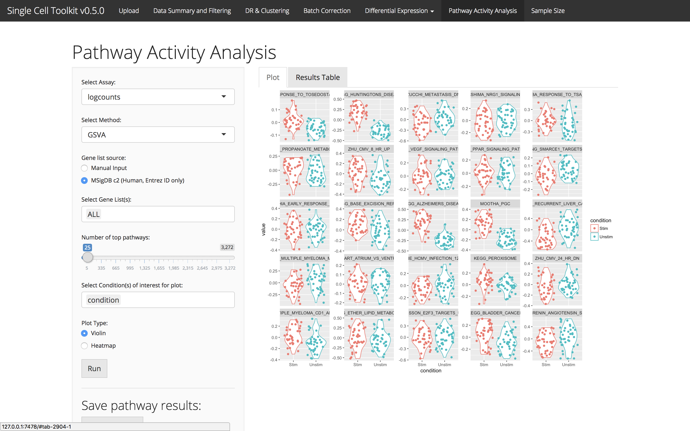

# Introduction

Gene expression measurements can be summarized into a signature or set of genes
to create a score that represents the activity of that set of genes in a sample.
By summarizing genes in known signaling pathways, cells with active signaling
pathways or specific cellular functions can be identified. Gene Set Variation
Analysis (GSVA) uses gene sets to create these signatures.

# Manual Input

The SCTK can profile pathway activity using signatures saved in the gene
annotation data frames in a SCtkExperiment object. These pathway annotations
should be numeric vectors of 1 (in signature) and 0 (not in signature).

# MSigDB

For human samples with entrez gene id annotations, it is possible to perform
pathway activity analysis across MSigDB c2 or a subset of MSigDB. Choose a
condition and the pathway tab will report the top differentially active pathways
across that annotation.

# Visualization

Pathway activity results can be visualized in the "Plot" tab using either a
heatmap or a violin plot. A condition variable is required for the violin plots.

# Save Pathway Results

Pathway results can be saved in the SCTK gene annotation data frame or
downloaded directly in the pathway activity tab.

# Session info {.unnumbered}

```{r sessionInfo, echo=FALSE}
sessionInfo()
```
